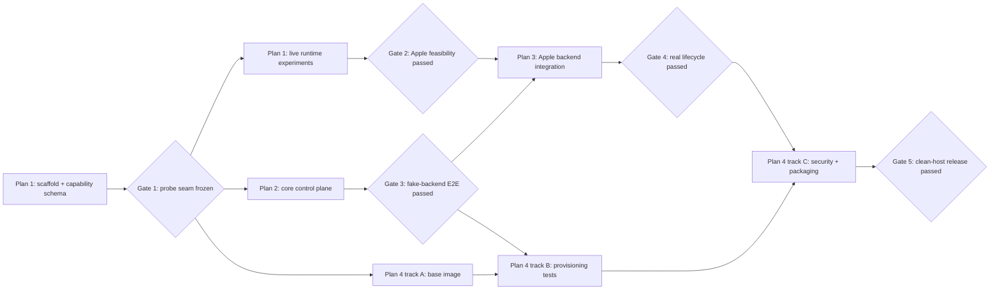

# Gas Can macOS MVP Coordinated Implementation Plan

> **For agentic workers:** REQUIRED SUB-SKILL: Use superpowers:subagent-driven-development (recommended) or superpowers:executing-plans to implement this plan task-by-task. Steps use checkbox (`- [ ]`) syntax for tracking.

**Goal:** Coordinate four independently reviewable plans that deliver the approved Gas Can macOS MVP from runtime feasibility through a release-gated polyglot sandbox.

**Architecture:** Gas Can is a Rust workspace containing a policy-owning core, a thin Apple `container` adapter, an on-demand Unix-socket daemon, and a CLI client. Work proceeds through explicit capability and contract gates; image work may run beside control-plane work, but production integration waits until both dependencies pass.

**Tech Stack:** Rust 1.85+ (edition 2024), Tokio, Tonic/protobuf over Unix sockets, SQLite via `rusqlite`, Clap, Serde/TOML, Apple `container` 1.x, OCI/Dockerfile, mise, shell-based security probes.

## Global Constraints

- The first release requires Apple silicon and macOS 26 or newer.
- Only the canonical selected code root is mounted from the host, read/write at `/workspace`.
- No host home, credentials, SSH agent, secrets, runtime sockets, devices, or arbitrary mounts are forwarded.
- One sandbox maps to one code root, one long-lived OCI container, and one Apple-provided lightweight VM.
- The workspace user has passwordless `sudo` to guest root; guest root never expands host access.
- Network modes are `networked` and provably `offline`; inability to prove offline enforcement blocks release.
- The CLI and future GUI use the same versioned daemon API on a user-owned Unix socket; no TCP listener exists.
- Apple runtime details remain behind `RuntimeBackend`; future Firecracker support must not alter client concepts.
- Rust code denies `unsafe_code`; production code must not use `unwrap`, `expect`, or deliberate panics.
- New Rust crates use the repository's existing `AGPL-3.0-only` license.
- Every behavioral change follows red-green-refactor and ends in a focused commit.

---

## Plan Set

1. [Apple Runtime Feasibility Plan](./2026-07-13-apple-runtime-feasibility.md) proves the external platform and freezes capability fixtures.
2. [Core Control Plane Plan](./2026-07-13-core-control-plane.md) builds backend-neutral policy, metadata, daemon API, and CLI using a fake runtime.
3. [Apple Backend and Lifecycle Plan](./2026-07-13-apple-backend-lifecycle.md) connects the control plane to the real Apple runtime and completes lifecycle behavior.
4. [Workspace Environment and Release Plan](./2026-07-13-workspace-environment-release.md) ships the image, mise/Gascamp provisioning, security suite, packaging, and clean-host release gate.

## Dependency Graph

## Phase 0: Repository and Contract Freeze

Owner: Plan 1.

- [x] Execute Plan 1 Tasks 1-3 to create the Rust workspace, shared runtime capability types, Apple command runner, and version fixtures.
- [x] Review the `RuntimeCapabilities`, `CommandRunner`, and error interfaces before other plans consume them. Plan 2 owns the backend-neutral `RuntimeBackend` contract.
- [x] Record the interface-freeze commit in the roadmap notes.

**Gate 1:** `cargo test --workspace` passes; fixtures cover supported and unsupported Apple versions; command execution is injectable; no Apple command shape leaks into core capability types.

## Phase 1: Parallel Feasibility, Core, and Image Tracks

After Gate 1, three worktrees may proceed concurrently:

- **Track A — Plan 1 remainder:** run real Apple lifecycle, mount, volume, TTY, signal, resource, port, and offline-network experiments.
- **Track B — Plan 2:** implement manifest policy, fake backend, SQLite state, reconciliation, Tonic API, daemon, and CLI.
- **Track C — Plan 4 Tasks 1-3 only:** build the ARM64 base image, install mise and bundled Gascamp, and run image-local smoke tests. This track must not integrate with `gascand` yet.

Concurrency rule: Track A owns `crates/gascan-apple/**` and runtime fixtures; Track B owns `crates/gascan-core/**`, `crates/gascand/**`, `crates/gascan/**`, and `proto/**`; Track C owns `images/**` and `tests/image/**`. Shared root manifests require coordination through a designated integration owner.

**Gate 2:** Plan 1's signed-off report proves or rejects every required Apple capability. Offline networking, canonical bind mounts, TTY/signal behavior, and owned cleanup are mandatory. A failed mandatory capability stops Plans 3 and 4 integration and returns the design to review.

**Gate 3:** Plan 2 passes unit, contract, daemon crash-recovery, and CLI end-to-end tests entirely against the fake backend.

## Phase 2: Real Backend and Provisioning Integration

After Gates 2 and 3:

- Execute Plan 3 against the frozen core contracts and the proven Apple command forms.
- Continue Plan 4 Tasks 4-6 in parallel: provisioning planner, `gascan apply`, setup digest behavior, and Gascamp source selection can be tested against the fake backend.
- Do not begin real-runtime security acceptance tests until Plan 3 publishes a stable integration-test harness.

Concurrency rule: Plan 3 owns Apple adapter and lifecycle wiring; Plan 4 owns image/provisioning modules. Changes to `RuntimeBackend` require joint review because they affect both tracks.

**Gate 4:** A supported Mac passes real `up`, `shell`, `run`, `apply`, `down`, restart, reconciliation, and `destroy`; exact exit codes, terminal resize, signals, and no orphaned owned resources are verified.

## Phase 3: Security, Packaging, and Release

After Gate 4, finish Plan 4:

- Run security acceptance tests against the real Apple backend.
- Verify offline mode fails closed and networked ports bind only to loopback.
- Verify the image smoke matrix and persistent cache behavior.
- Build signed/notarization-ready artifacts and installation scripts.
- Execute the clean-host release checklist.

**Gate 5:** Every release check passes on a clean Apple-silicon macOS 26+ host, including offline isolation and cleanup. This gate is the definition of MVP completion.

## Cross-plan Integration Rules

- Each plan works in its own git worktree created at execution time.
- Rebase or merge only after that plan's tests and review gate pass.
- Shared protocol or domain types change through an interface-change commit reviewed by active plan owners.
- No plan may weaken a security constraint to make an integration test pass. Record the mismatch and return to design review.
- Runtime integration tests are marked and skipped on unsupported hosts; unit and fake-backend tests remain runnable everywhere Rust supports the workspace.
- Generated protobuf files are build outputs, not committed, unless reproducible builds on the selected toolchain require vendoring.
- Capability reports record Apple CLI version, macOS build, architecture, image digest, command transcript with sanitized paths, and observed result.

## Program-level Verification

- [ ] Run `cargo fmt --all -- --check`; expect exit 0.
- [ ] Run `cargo clippy --workspace --all-targets --all-features -- -D warnings`; expect exit 0.
- [ ] Run `cargo test --workspace`; expect all platform-neutral tests pass.
- [ ] Run `cargo test --workspace -- --ignored`; on a supported Mac, expect all Apple integration tests pass serially.
- [ ] Run `./tests/security/run.sh`; expect every forbidden host/network probe denied.
- [ ] Run `./tests/release/clean-host.sh`; expect `PASS: Gas Can macOS MVP release gate` and no owned resources from the test remain.

## Roadmap Completion Record

When each gate passes, update this section in a dedicated commit with the commit SHA and evidence path:

| Gate | Required evidence | Commit | Status |
|---|---|---|---|
| 1 — Probe seam freeze | workspace tests and reviewed probe contracts | `48a7a18` | passed |
| 2 — Apple feasibility | `docs/feasibility/apple-container-report.md` | `6bedef8` | passed |
| 3 — Fake E2E | core/daemon/CLI test transcript | not-run | pending |
| 4 — Real lifecycle | Apple integration test transcript | not-run | pending |
| 5 — Release | clean-host and security reports | not-run | pending |
