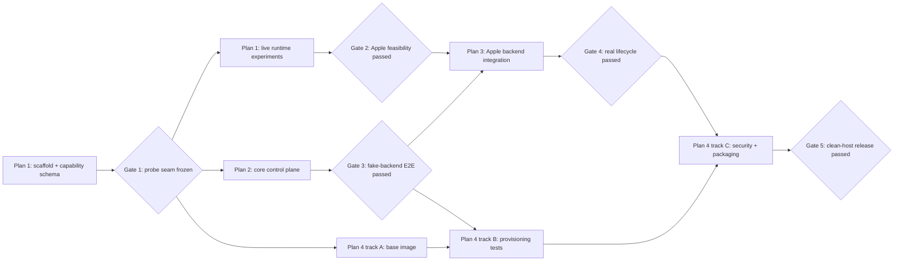

# Gas Can macOS MVP Coordinated Implementation Plan

> **For agentic workers:** REQUIRED SUB-SKILL: Use superpowers:subagent-driven-development (recommended) or superpowers:executing-plans to implement this plan task-by-task. Steps use checkbox (`- [ ]`) syntax for tracking.

**Goal:** Coordinate four independently reviewable plans that deliver the approved Gas Can macOS MVP from runtime feasibility through a release-gated polyglot sandbox.

**Architecture:** Gas Can is a Rust workspace containing a policy-owning core, a thin Apple `container` adapter, an on-demand Unix-socket daemon, and a CLI client. Work proceeds through explicit capability and contract gates; image work may run beside control-plane work, but production integration waits until both dependencies pass.

**Tech Stack:** Rust 1.85+ (edition 2024), Tokio, Tonic/protobuf over Unix sockets, SQLite via `rusqlite`, Clap, Serde/TOML, Apple `container` 1.x, OCI/Dockerfile, mise, shell-based security probes.

## Global Constraints

- The first release requires Apple silicon and macOS 26 or newer.
- Only the canonical selected code root is mounted from the host, read/write at `/workspace`.
- No host home, credentials, SSH agent, secrets, runtime sockets, devices, or arbitrary mounts are forwarded.
- One sandbox maps to one code root, one long-lived OCI container, and one Apple-provided lightweight VM.
- The workspace user has passwordless `sudo` to guest root; guest root never expands host access.
- Network modes are `networked` and provably `offline`; inability to prove offline enforcement blocks release.
- The CLI and future GUI use the same versioned daemon API on a user-owned Unix socket; no TCP listener exists.
- Apple runtime details remain behind `RuntimeBackend`; future Firecracker support must not alter client concepts.
- Rust code denies `unsafe_code`; production code must not use `unwrap`, `expect`, or deliberate panics.
- New Rust crates use the repository's existing `AGPL-3.0-only` license.
- Every behavioral change follows red-green-refactor and ends in a focused commit.

---

## Plan Set

1. [Apple Runtime Feasibility Plan](./2026-07-13-apple-runtime-feasibility.md) proves the external platform and freezes capability fixtures.
2. [Core Control Plane Plan](./2026-07-13-core-control-plane.md) builds backend-neutral policy, metadata, daemon API, and CLI using a fake runtime.
3. [Apple Backend and Lifecycle Plan](./2026-07-13-apple-backend-lifecycle.md) connects the control plane to the real Apple runtime and completes lifecycle behavior.
4. [Workspace Environment and Release Plan](./2026-07-13-workspace-environment-release.md) ships the image, mise/Gascamp provisioning, security suite, packaging, and clean-host release gate.
5. [Offline Workspace Image Bundles Plan](./2026-07-14-offline-workspace-image-bundles.md) is implemented through a PENDING live gate and retained as deferred reproducibility/offline hardening. It is not on the macOS MVP critical path after the 2026-07-15 connected-builder diagnosis.
6. [Plan 4 connected-build continuation addendum](./2026-07-15-connected-workspace-image.md) replaces Plan 4's offline-only image assumption for the MVP. It is subordinate to Plan 4, not a new phase or product plan. Its exact public, digest-qualified ARM64 image passed the connected workspace image gate on 2026-07-18 and is the approved prebuilt MVP input.

Current restart state, accepted branch heads, and unfinished work are recorded
in [`docs/status/macos-mvp-handoff.md`](../../status/macos-mvp-handoff.md).

## Dependency Graph

## Phase 0: Repository and Contract Freeze

Owner: Plan 1.

- [x] Execute Plan 1 Tasks 1-3 to create the Rust workspace, shared runtime capability types, Apple command runner, and version fixtures.
- [x] Review the `RuntimeCapabilities`, `CommandRunner`, and error interfaces before other plans consume them. Plan 2 owns the backend-neutral `RuntimeBackend` contract.
- [x] Record the interface-freeze commit in the roadmap notes.

**Gate 1:** `cargo test --workspace` passes; fixtures cover supported and unsupported Apple versions; command execution is injectable; no Apple command shape leaks into core capability types.

## Phase 1: Parallel Feasibility, Core, and Image Tracks

After Gate 1, three worktrees may proceed concurrently:

- **Track A — Plan 1 remainder:** run real Apple lifecycle, mount, volume, TTY, signal, resource, port, and offline-network experiments.
- **Track B — Plan 2:** implement manifest policy, fake backend, SQLite state, reconciliation, Tonic API, daemon, and CLI.
- **Track C — Plan 4 Tasks 1-3 only:** build the ARM64 base image, install mise and bundled Gascamp, and run image-local smoke tests. This track must not integrate with `gascand` yet.

Concurrency rule: Track A owns `crates/gascan-apple/**` and runtime fixtures; Track B owns `crates/gascan-core/**`, `crates/gascand/**`, `crates/gascan/**`, and `proto/**`; Track C owns `images/**` and `tests/image/**`. Shared root manifests require coordination through a designated integration owner.

**Gate 2:** Plan 1's signed-off report proves or rejects every required Apple capability. Offline networking, canonical bind mounts, TTY/signal behavior, and owned cleanup are mandatory. A failed mandatory capability stops Plans 3 and 4 integration and returns the design to review.

Binding Task 5 interpretation: the frozen Gate 2 report at commit `6bedef8` (SHA-256 `df51167b450c3fd0eb80699db76b4decbd7c44ab7f73788eee3240eb19057ad1`) is capability and MVP-kernel evidence only when the current host is supported and both the exact release 1.1.0 client and exact running 1.1.0 API server match Apple revision `5973b9cc626a3e7a499bb316a958237ebe14e2ed` and the approved structured status schema. The status fixture SHA-256 is `00e66b6721f5b9ce185b98bef47f0699425d06bff6396b4e29e90f55e9079cf9`. Any mismatch fails closed.

**Gate 3:** Plan 2 passes unit, contract, daemon crash-recovery, and CLI end-to-end tests entirely against the fake backend.

## Phase 2: Real Backend and Provisioning Integration

After Gates 2 and 3:

- Execute Plan 3 against the frozen core contracts and the proven Apple command forms.
- Continue Plan 4 Tasks 4-6 in parallel: provisioning planner, `gascan apply`, setup digest behavior, and Gascamp source selection can be tested against the fake backend.
- Execute the connected workspace image plan before accepting Plan 4 image
  smoke evidence. The 2026-07-15 diagnostic proved Apple build-VM public
  connectivity after correcting a local firewall; deliberate build-VM network
  isolation is not an MVP requirement.
- Do not begin real-runtime security acceptance tests until Plan 3 publishes a stable integration-test harness.

Concurrency rule: Plan 3 owns Apple adapter and lifecycle wiring; Plan 4 owns image/provisioning modules. Changes to `RuntimeBackend` require joint review because they affect both tracks.

**Gate 4:** A supported Mac passes real `up`, `shell`, `run`, `apply`, `down`, restart, reconciliation, and `destroy`; exact exit codes, terminal resize, signals, and no orphaned owned resources are verified.

### Phase 2 granular status — 2026-07-20

| Workstream | Status | Accepted branch evidence | Remaining acceptance work |
|---|---|---|---|
| Plan 3 Apple request, inspection, lifecycle, attach, and doctor | implemented, independently reviewed, integrated, and accepted through Gate 4 | accepted integration head `a475f8c` on `feature/gate4-integration` | none for the macOS MVP |
| Plan 3 Gate 4 harness | implemented, independently approved, integrated, and passed live | accepted integration head `a475f8c` | none for Gate 4 |
| Plan 4 image/user/mise/Gascamp contracts | connected image gate passed on Apple Container 26.5.1 using the exact public GHCR `linux/arm64` index; approved marker is frozen into policy and was consumed by Gate 4 and Gate 5 | connected head `f6ed3a5`, merge `229c33a`; `docs/evidence/connected-workspace-image.md` and `images/workspace/approved-image.txt` are authoritative | none for the macOS MVP |
| Offline bundle production and validation | implementation reviewed; publication and live evidence not completed | `809796e` through `9025c56` | deferred; `publication = "pending"` remains accurate |
| Plan 4 provisioning/apply/setup behavior | complete and independently reviewed; trusted live apply passed | Task 5 head `1d42522`; Task 6 head `3de3c82` | none for the macOS MVP |
| Cross-plan integration | Tasks 7–8, Gate 4 corrections, and final program verification completed and independently reviewed on `feature/gate4-integration` | live release semantics `4a6d4ee`; final reviewed status `280f835`; frozen base `917dac1`; Apple merge `d06d619`; connected-image merge `229c33a` | none for the macOS MVP |
| Gate 4 | passed | accepted implementation head `a475f8c`; exact serial lifecycle and recovery evidence below | none |
| Gate 5 | passed | clean-host wrapper exit 0 at `4a6d4ee`; global verification and empty final audit at `280f835` | none for the defined macOS MVP |

Gate 4 passed on 2026-07-19 at accepted implementation head
`a475f8c7e1e1c955ea28279c5f711ee2b8c8f2ac`. The exact required commands ran
serially:

1. `bash ./scripts/run-apple-e2e.sh apple_lifecycle` exited 0.
   `cli_lifecycle_survives_daemon_and_host_state_changes ... ok`; 1 passed,
   0 failed, 0 ignored, 26 filtered out; 6.77 seconds.
2. Only after lifecycle passed,
   `bash ./scripts/run-apple-e2e.sh apple_recovery` exited 0.
   `cli_recovers_from_stale_daemon_metadata_and_runtime_truth ... ok`;
   1 passed, 0 failed, 0 ignored, 26 filtered out; 6.53 seconds.

Both runs reported macOS 26.5.1 on arm64, Apple `container` 1.1.0 release at
commit `5973b9cc626a3e7a499bb316a958237ebe14e2ed`, and
`container-apiserver` 1.1.0 at the same commit. After both passed, read-only
inventory checks found no IDs or names containing `gate4` in
`container list --all --format json` or `container volume list --format json`;
`/private/tmp/gascan-gate4-501` was absent or empty. Unrelated pre-existing
Apple resources were preserved.

The accepted implementation also includes independently clean-reviewed
corrections `8cc59c3` (safe protocol-v2 per-exec terminal/locale environment
overlay), `a686344` (exact raw Apple guest PTY CRLF harness expectation), and
`a475f8c` (bounded PTY resize readiness diagnostics).

This section records Gate 4 evidence only. Gate 5 and MVP completion are based
on the later Phase 3 evidence below, not inferred from this section.

## Phase 3: Security, Packaging, and Release

After Gate 4, finish Plan 4:

- Run security acceptance tests against the real Apple backend.
- Verify offline mode fails closed and networked ports bind only to loopback.
- Verify the image smoke matrix and persistent cache behavior.
- Build signed/notarization-ready artifacts and installation scripts.
- Execute the clean-host release checklist.

**Gate 5:** Every release check passes on a clean Apple-silicon macOS 26+ host, including offline isolation and cleanup. This gate is the definition of MVP completion.

### Phase 3 completion — 2026-07-20

Plan 4 Tasks 5–8 are complete and independently reviewed. The Gate 5
clean-host wrapper exited 0 at signed release-semantics head `4a6d4ee`, printed
`PASS: Gas Can macOS MVP release gate`, and left an empty authoritative host
audit. Signed successors `695e56f` and `280f835` are test-only structural and
macOS E2E socket-path corrections; independent review found no release
semantics change.

At final reviewed status head `280f835`, formatting and exact workspace Clippy
passed; the normal workspace suite passed 451 tests with 14 ignored across 50
suites. Safe ignored coverage passed `gascan-apple` 10/10 and
`apple_apply`, `apple_lifecycle`, and `apple_recovery` 1/1 each. Raw security
correctly refused without its trusted manifest; the official security runner
then passed 1/1 with TAP `ok 1` / `1..1` on macOS 26.5.1 arm64 and Apple
client/server 1.1.0 at exact commit
`5973b9cc626a3e7a499bb316a958237ebe14e2ed`. The independent
`final_mvp_verification` audit exited 0 with no output.

This passes Gate 5 and therefore completes the roadmap-defined macOS MVP. It
does not claim a signed or notarized artifact, public distribution, or any
deferred offline/builder-isolation, Linux/Firecracker, or GUI deliverable.

## Cross-plan Integration Rules

- Each plan works in its own git worktree created at execution time.
- Rebase or merge only after that plan's tests and review gate pass.
- Shared protocol or domain types change through an interface-change commit reviewed by active plan owners.
- No plan may weaken a security constraint to make an integration test pass. Record the mismatch and return to design review.
- Runtime integration tests are marked and skipped on unsupported hosts; unit and fake-backend tests remain runnable everywhere Rust supports the workspace.
- Generated protobuf files are build outputs, not committed, unless reproducible builds on the selected toolchain require vendoring.
- Capability reports record Apple CLI version, macOS build, architecture, image digest, command transcript with sanitized paths, and observed result.

## Program-level Verification

- [x] Run `cargo fmt --all -- --check`; exited 0 at `280f835`.
- [x] Run `cargo clippy --workspace --all-targets --all-features -- -D warnings`; exited 0 at `280f835`.
- [x] Run `cargo test --workspace`; 451 passed, 14 ignored across 50 suites at `280f835`.
- [x] Run supported-Mac ignored coverage serially. All non-security ignored tests passed through raw Cargo; safety-gated security intentionally required the trusted official runner and passed below.
- [x] Run `./tests/security/run.sh`; exact trusted-manifest security acceptance passed 1/1 with TAP `ok 1` / `1..1`.
- [x] Run `./tests/release/clean-host.sh`; Gate 5 wrapper exited 0 at `4a6d4ee`, printed `PASS: Gas Can macOS MVP release gate`, and the final audit was empty.

## Roadmap Completion Record

When each gate passes, update this section in a dedicated commit with the commit SHA and evidence path:

| Gate | Required evidence | Commit | Status |
|---|---|---|---|
| 1 — Probe seam freeze | workspace tests and reviewed probe contracts | `48a7a18` | passed |
| 2 — Apple feasibility | `docs/feasibility/apple-container-report.md` | `6bedef8` | passed |
| 3 — Fake E2E | `docs/evidence/gate-3-fake-e2e.md` | `7c7d083` | passed |
| 4 — Real lifecycle | exact serial Apple lifecycle and recovery results recorded above | `a475f8c` | passed |
| 5 — Release | clean-host wrapper PASS, trusted security PASS, and empty final host audit recorded above | `4a6d4ee` (release semantics), `280f835` (final reviewed status) | passed |

## MVP Status Summary — 2026-07-20

- Completed and integrated: Phases 0–3 and Roadmap Gates 1–5. Gate 4 passed at
  accepted implementation head `a475f8c` with the exact serial live lifecycle,
  recovery, and residue evidence recorded above.
- The accepted Gate 4 implementation includes the reviewed Apple backend and
  harness at `dbf4235` via merge `d06d619`, the accepted connected-image
  history at `f6ed3a5` via merge `229c33a`, and the independently clean-reviewed
  corrections `8cc59c3`, `a686344`, and `a475f8c`.
- Accepted image input: the
  exact public GHCR image passed the connected workspace image gate on Apple
  Container 26.5.1. Anonymous public registry access, all three image smokes,
  and current-run cleanup passed. The authoritative tracked records are
  `docs/evidence/connected-workspace-image.md` and
  `images/workspace/approved-image.txt`. Apple builder context-streaming
  reliability is tracked separately in
  [`Liquescent-Development/gascan#1`](https://github.com/Liquescent-Development/gascan/issues/1).
  It does not invalidate the accepted prebuilt image.
- Gate 5 passed at release-semantics head `4a6d4ee`; final reviewed test-only
  successors culminate at `280f835`. Under this roadmap's definition, the
  macOS MVP is complete on the supported platform.
- Deferred and not MVP blockers: offline bundle publication, builder-VM
  network isolation, Linux/Firecracker, and the GUI.
- The accepted package is an unsigned development artifact. No public
  distribution, signing, or notarization evidence is claimed.
